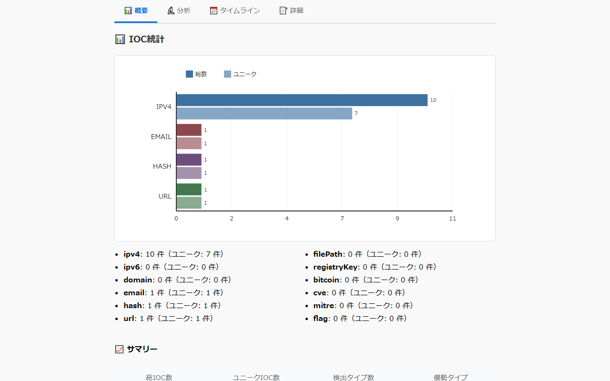
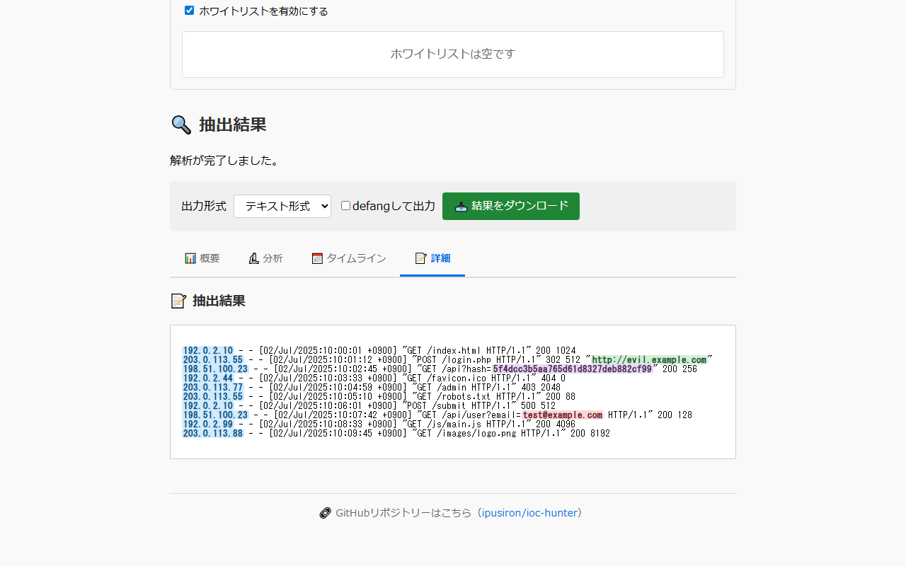
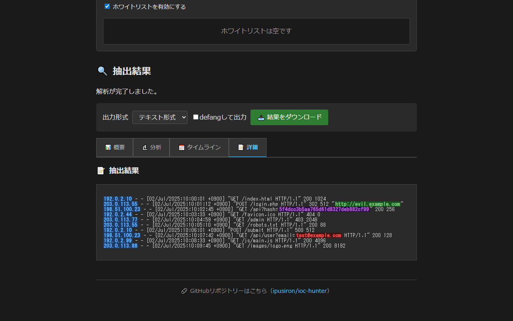

<!--
---
id: day016
slug: ioc-hunter

title: "IOC Hunter"

subtitle_ja: "ログから侵害の痕跡を自動検出・可視化"
subtitle_en: "Automatically detect and visualize Indicators of Compromise from logs"

description_ja: "ログファイルやテキストデータからIOC（侵害の痕跡）を自動抽出し、12種類のIOCタイプを色分けハイライト表示するWebツール。関連性分析、タイムライン解析、詳細統計機能を搭載し、本格的な脅威分析が可能。ブラウザー完結でプライバシーに配慮。"
description_en: "A web tool that automatically extracts IOCs (Indicators of Compromise) from log files and text data, highlighting 12 types of IOCs with color coding. Features include relationship analysis, timeline analysis, and detailed statistics for comprehensive threat analysis. All processing is done client-side for privacy."

category_ja:
  - 脅威インテリジェンス
  - ログ解析
  - フォレンジック
category_en:
  - Threat Intelligence
  - Log Analysis
  - Forensics

difficulty: 2

tags:
  - IOC
  - ログ解析
  - フォレンジック
  - 脅威ハンティング
  - CTF

repo_url: "https://github.com/ipusiron/ioc-hunter"
demo_url: "https://ipusiron.github.io/ioc-hunter/"

hub: true
---
-->

# IOC Hunter - ログから侵害の痕跡を抽出するツール

[English](README.en.md) · 日本語

[](https://github.com/ipusiron/ioc-hunter/stargazers)
[](https://github.com/ipusiron/ioc-hunter/forks)
[](https://github.com/ipusiron/ioc-hunter/commits/main)
[](LICENSE)
[](https://ipusiron.github.io/ioc-hunter/)

**Day016 - 生成AIで作るセキュリティツール100**

**IOCハンター（IOC Hunter）**は、ログファイルやテキストデータの中からIOC（Indicator of Compromise：侵害の痕跡）を自動で抽出・色分け表示してくれる高機能Webツールです。

12種類のIOCタイプを検出し、種類ごとに色分けして視覚的にわかりやすくハイライトします。さらに、高度な関連性分析、タイムライン解析、詳細統計機能を搭載し、本格的な脅威分析が可能です。

## 🌐 デモページ

👉 [https://ipusiron.github.io/ioc-hunter/](https://ipusiron.github.io/ioc-hunter/) 

---

## 📸 スクリーンショット

以下は実際の画面例です。


> *ライトモードの概要タブ。Apacheログの統計とグラフ。*


> *ライトモードの詳細タブ。元のログを保ったIOCハイライト。*


> *ダークモードの詳細タブ。文字と背景のコントラストを調整した配色。*

---

## ✨ 機能

### 基本機能
- **12種類のIOC検出**: IPv4/IPv6、ドメイン、メール、ハッシュ、URL、ファイルパス、レジストリキー、Bitcoin、CVE、MITRE ATT&CK技術ID、CTFフラグ
- **ハイライト表示**: 検出したIOCをテキスト内で種類別に色分け表示
- **統計情報**: IOCの種類ごとに分類・一覧化し、重複を除いた詳細統計
- **ブラウザー完結**: インストール不要、プライバシー配慮（ローカル処理）

### 高度な分析機能
- **関連性分析**: IOC間の共起関係、ドメイン-IP関連、ファイル-ハッシュ関連を自動検出
- **タイムライン分析**: ログの時系列解析、イベントグループ化、重要度評価
- **詳細統計**: 分布分析、繰り返しパターン検出、リスク評価
- **タブベース表示**: 概要、分析、タイムライン、詳細の4つのタブで結果を整理

### UI/UX機能
- **ダークモード**: 長時間の分析作業に配慮したダークテーマ
- **ホワイトリスト**: 既知の安全なIOCを除外する機能（永続化対応）
- **エクスポート**: JSON/CSV/TXT形式での結果出力
- **ヘルプモーダル**: 各IOCタイプの説明とサンプル表示
- **日本語・英語の切り替え**: 画面右上のボタンで切り替え、選択はブラウザーに保存（`?lang=ja` / `?lang=en` でも指定可能）
- **レスポンシブデザイン**: モバイル・タブレット対応

---

## 🎯 想定ユーザー

- ログ解析を学びたいセキュリティ初心者
- フォレンジックやOSINT系のCTFプレイヤー
- SOC（Security Operation Center）オペレーター
- インシデントレスポンスチーム
- セキュリティ研修・教育担当者
- 脅威ハンティング従事者

---

## 📋 検出可能なIOCタイプ

| IOCタイプ | 説明 | 例 |
|---------|------|-----|
| IPv4 | IPv4アドレス | `192.168.1.1` |
| IPv6 | IPv6アドレス | `2001:db8::1` |
| Domain | ドメイン名 | `example.com` |
| Email | メールアドレス | `user@example.com` |
| Hash | MD5/SHA-1/SHA-256/SHA-512ハッシュ | `d41d8cd98f00b204e9800998ecf8427e` |
| URL | ウェブURL | `https://example.com/path` |
| FilePath | ファイルパス | `C:\Windows\System32\cmd.exe` |
| RegistryKey | Windowsレジストリキー | `HKLM\SOFTWARE\Microsoft` |
| Bitcoin | Bitcoinアドレス | `1A1zP1eP5QGefi2DMPTfTL5SLmv7DivfNa` |
| CVE | CVE脆弱性番号 | `CVE-2021-44228` |
| MITRE | MITRE ATT&CK技術ID | `T1059.001` |
| Flag | CTFフラグ | `flag{example_flag}` `CTF{another_flag}` |

---

## 🎯 ユースケース

### CTF（Capture The Flag）での活用例
IOCハンターは、CTFのフォレンジックやログ解析系問題で特に有効です。

- **大量のログファイルに埋もれたフラグ文字列の検出**
    - 例：flag{}、CTF{}、picoCTF{}などの様々なフラグ形式を自動検出
    - ハッシュ、IPアドレスがヒントになる設問でも一括ハイライト
- **攻撃元のIPや不審なドメインの発見**
    - 例：auth.logやaccess.log内の繰り返し出現するアドレスに注目
- **タイムライン分析による攻撃フローの把握**
    - 複数のログエントリを時系列で関連付けて攻撃手順を可視化
- **関連性分析による隠れた手がかりの発見**
    - IOC間の関連性から攻撃者のインフラストラクチャを推測

#### 🚩 CTFフラグ検出について

**対応フラグ形式**
- 一般的な形式: `flag{content}`, `FLAG{CONTENT}`
- プラットフォーム別: `CTF{}`, `picoCTF{}`, `hacktheBox{}`, `TryHackMe{}`
- 短縮形式: `HTB{}`, `THM{}`

**検出例**
```
flag{this_is_a_sample_flag}
CTF{another_example_flag}
picoCTF{pico_flag_example}
hacktheBox{htb_challenge_flag}
TryHackMe{thm_room_flag}
HTB{short_format}
THM{short_format}
```

フラグは赤色でハイライト表示され、統計情報や分析結果にも含まれます。

### 実務での活用例（SOC・インシデント対応など）

**脅威ハンティング**
- CVE番号とMITRE ATT&CK技術IDの関連分析
- 攻撃者のTTP（戦術・技術・手順）の特定
- IOC関連性分析による攻撃インフラの全体像把握

**インシデント調査**
- タイムライン分析によるアタックフローの再構築
- ホワイトリスト機能による誤検知の削減
- 詳細統計による被害範囲の定量的評価

**IOC管理**
- 複数ログソースからのIOC一括抽出
- エクスポート機能による他ツール（VirusTotal、AbuseIPDBなど）との連携
- 繰り返しパターン検出による持続的脅威の発見

### セキュリティ教育や演習環境での教材として

**教育・研修活用**
- 受講者にログファイルを配布し、「IOCを抽出せよ」などの演習に活用
- CTFフラグの検出練習や各IOCタイプの学習教材として（ヘルプモーダル活用）
- 分析結果の読み方・解釈方法の指導

**演習環境での活用**
- `samples/list.txt`ファイルを編集すれば、独自の演習用ログをすぐに組み込み可能
- オフラインで完結するため、クローズドな演習環境にも最適
- リアルタイムでの分析結果確認による学習効果向上

---

## 📖 使い方

### 基本的な使い方
1. **ファイル読み込み**: ドラッグ&ドロップまたはファイル選択でログファイルを読み込み
2. **解析実行**: 「解析する」ボタンでIOC検出を実行
3. **結果確認**: 4つのタブで分析結果を確認

## 📐 画面構成
- **概要タブ**: 基本統計とグラフ、詳細統計情報
- **分析タブ**: IOC間の関連性分析結果
- **タイムラインタブ**: 時系列イベント分析結果
- **詳細タブ**: 元の入力を保ったハイライト付き抽出結果

### ホワイトリスト機能
- **追加**: 誤検知するIOCを入力して除外リストに追加
- **管理**: 登録済みアイテムの確認・削除
- **永続化**: ブラウザーのLocalStorageで設定を保存

### エクスポート機能
- **JSON**: 構造化データとして出力（他ツール連携用）
- **CSV**: スプレッドシート分析用
- **TXT**: シンプルなテキスト形式

---

## 🔬 技術的な説明

### アーキテクチャ
- **フロントエンド**: ES6モジュール化されたJavaScript
- **ストレージ**: LocalStorage（設定の永続化）
- **チャート**: Canvas APIによる統計グラフ描画
- **スタイル**: CSS Grid/Flexboxによるレスポンシブデザイン

### パフォーマンス・制限事項
- **ファイルサイズ制限**: 20MB。まず200行程度で試し、長いログは分割を推奨
- **実測の目安**: WindowsのChromium、Apacheログ10行を20回繰り返した200行で、統計・ハイライト・相関・タイムライン・画面更新を含め13ms。環境とログ内容で変動するため保証値ではない
- **処理能力**: 共起・近接分析は行インデックスを共有し、相関の生成を20,000件で打ち切る。数万行のログでは一部だけの表示となる場合がある
- **プライバシー**: すべての処理がローカルで完結（外部送信なし）
- **ブラウザー要件**: ES6対応ブラウザー（Chrome、Firefox、Safari、Edge）

---

### 検出と表示の流れ

`scan()`の検出結果を統計・ハイライト・関連性分析で共有します。タイプごとの候補検出後、開始位置、長さ、タイプの優先度の順で重なりを解決します。生成したHTMLを再検索しないため、元の入力にない文字や入れ子のハイライトを作りません。

タイムスタンプはISO 8601・Apache・BIND・Simple・syslogの5形式です。オフセットなしはUTC、年のないsyslogは比較用に1970年とみなし、表示には原文を使います。閲覧端末のタイムゾーンには依存しません。

### カスタマイズ
- **新しいIOCパターン追加**: `js/config.js`の正規表現パターンを編集
- **CTFフラグ形式追加**: `config.js`のflagパターンに新しいプラットフォーム形式を追加
- **サンプルログ追加**: `samples/`ディレクトリにファイル追加後、`samples/list.txt`を更新（`ファイル名:日本語のラベル:英語のラベル`の3列）
- **文言の追加・変更**: `js/i18n.js`の`ja`と`en`に同じキーを足す（キーの過不足はテストが落とす）
- **スタイル変更**: `css/style.css`でテーマ・色彩をカスタマイズ

---

## 🔒 セキュリティとプライバシー

入力の解析・defang/refang・エクスポートはブラウザー内で完結し、外部送信しません。通信はページ自身と同じ配信元のファイル・サンプルの読み込みだけです。localStorageにはテーマ、ホワイトリスト、言語の選択を保存します。入力ログや解析結果は保存しません。

CSPではscript・style・fontをselfに制限し、object-srcはnone、connect-srcはselfとしています。インラインスクリプト・インラインスタイルを許可せず、referrerはno-referrerです。metaではframe-ancestorsを強制できないため、埋め込み制限はこの設定だけでは実現できません。

CSVは全セルを引用符で囲み、引用符を二重化します。数式として解釈される先頭文字にはシングルクオートを付けます。JSONではURLにhostを添えます。

### defang表記

元の表記を画面に残し、refangした値で重複を集計します。

| 入力 | タイプ | 正規形 |
|---|---|---|
| `192[.]168[.]1[.]1` | ipv4 | `192.168.1.1` |
| `evil[.]com` | domain | `evil.com` |
| `evil(.)com` | domain | `evil.com` |
| `evil{.}com` | domain | `evil.com` |
| `user[@]example[.]com` | email | `user@example.com` |
| `hxxp://evil.com/a` | url | `http://evil.com/a` |
| `hxxps://evil[.]com/payload.exe` | url | `https://evil.com/payload.exe` |
| `sub[.]evil[.]co[.]jp` | domain | `sub.evil.co.jp` |

`(@)`・`[at]`もメールの区切り、`[://]`・`[:]//`もURLの区切りとして扱います。「defangして出力」を選ぶと、JSON/CSV/TXTのネットワーク系IOCだけを安全な表記に変換します。ファイルパス、レジストリキー、ハッシュ、CVE、MITRE、フラグは変えません。

## ⚠️ 注意・既知の限界

- ドメインはIANAのTLD一覧（Version 2026092000、1,438件）で検証。`internal.local`・`hidden.service`などの内部名は検出対象外
- `.sh`・`.md`・`.py`・`.zip`は実在するTLDのため、単独のファイル名と紛れる可能性あり
- URLに含まれるホスト名はURLとして1件に数え、ドメインには計上しない（旧版からの変更点）
- IPv6は圧縮・IPv4埋め込み・ゾーンIDに対応。時刻やMACアドレスは対象外
- Bitcoinアドレスは形式のみの判定でチェックサムは検証しない
- 関連性やリスク評価は調査の手がかりであり、侵害や悪性を確定する判定ではない
- ホワイトリストは端末に残るため、共有端末では利用後に削除を推奨

## ❓ FAQ

### file://で開くと動かないのはなぜですか

ES moduleがブラウザーのCORS制約を受けるためです。以下の動作環境の手順でHTTP配信してください。

### TLD一覧を更新するにはどうしますか

IANAの[TLD一覧](https://data.iana.org/TLD/tlds-alpha-by-domain.txt)を管理者が手動で取得し、先頭コメントの版と更新日を確認します。コメント以外の空でない行を大文字の配列に変換して`data/tlds.js`の`TLDS`へ格納し、`TLD_LIST_VERSION`・`TLD_LIST_UPDATED`と件数テストを一緒に更新します。実行時の自動取得は行いません。

## 🔗 参考

- [IANA Root Zone Database](https://www.iana.org/domains/root/db)
- [IPv6 Addressing Architecture（RFC 4291）](https://www.rfc-editor.org/rfc/rfc4291)
- [CSV形式（RFC 4180）](https://www.rfc-editor.org/rfc/rfc4180)

## 🧪 テスト

Node 22以上で`npm test`を実行します。依存パッケージのインストールは不要です。GitHub Actionsでもpushとpull_requestのたびに実行し、READMEの表と例、5タイムゾーンでの結果一致、配色、サンプルの件数、日本語と英語の辞書の対応を検証します。

## 📁 ディレクトリー構造

```text
ioc-hunter/
├── .github/workflows/test.yml
├── .gitignore
├── .nojekyll
├── assets/                   # 新旧のスクリーンショット
├── css/style.css
├── data/tlds.js               # 同梱IANA TLDデータ
├── js/
│   ├── analysisEngine.js
│   ├── chartRenderer.js
│   ├── config.js
│   ├── darkModeHandler.js
│   ├── exportHandler.js
│   ├── fileHandler.js
│   ├── helpModal.js
│   ├── i18n.js                # 日本語・英語の辞書とDOMへの適用
│   ├── iocAnalyzer.js
│   ├── scanner.js
│   ├── script.js
│   ├── tabManager.js
│   ├── timeline.js
│   ├── uiController.js
│   └── whitelistManager.js
├── samples/                  # 6本のログとlist.txt
├── test/                     # パターン・表示・日時・出力・文書・配色・日英
├── index.html
├── package.json
├── CLAUDE.md
├── LICENSE
├── README.en.md
└── README.md
```

## 💻 動作環境

ES moduleに対応したモダンブラウザー（Chrome、Firefox、Safari、Edge）を使用します。ローカルではリポジトリーのルートで次を実行し、表示されたポートをブラウザーで開いてください。

```sh
python -m http.server 8000 --bind 127.0.0.1
```

アクセス先は`http://127.0.0.1:8000/`です。Nodeはテスト用であり、ツールの実行には不要です。

## 📄 ライセンス

MIT License - [LICENSE](LICENSE)ファイルを参照

---

## 🛠️ このツールについて

本ツールは、「生成AIで作るセキュリティツール100」プロジェクトの一環として開発されました。 このプロジェクトでは、AIの支援を活用しながら、セキュリティに関連するさまざまなツールを100日間にわたり制作・公開していく取り組みを行っています。

プロジェクトの詳細や他のツールについては、以下のページをご覧ください。

🔗 [https://akademeia.info/?page_id=42163](https://akademeia.info/?page_id=42163)
