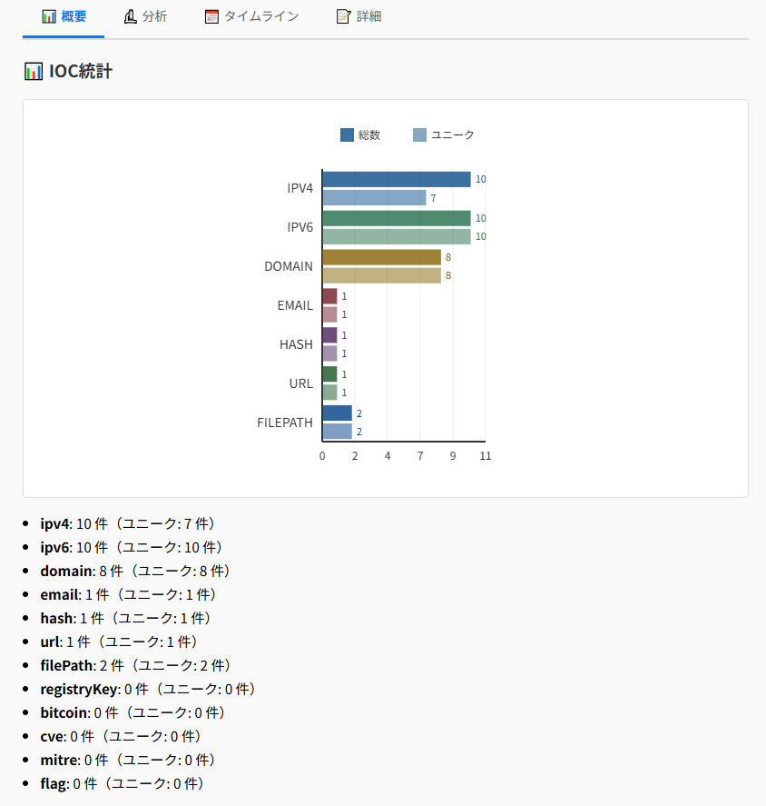

<!--
---
id: day016
slug: ioc-hunter

title: "IOC Hunter"

subtitle_ja: "ログから侵害の痕跡を自動検出・可視化"
subtitle_en: "Automatically detect and visualize Indicators of Compromise from logs"

description_ja: "ログファイルやテキストデータからIOC（侵害の痕跡）を自動抽出し、12種類のIOCタイプを色分けハイライト表示するWebツール。関連性分析、タイムライン解析、詳細統計機能を搭載し、本格的な脅威分析が可能。ブラウザ完結でプライバシーに配慮。"
description_en: "A web tool that automatically extracts IOCs (Indicators of Compromise) from log files and text data, highlighting 12 types of IOCs with color coding. Features include relationship analysis, timeline analysis, and detailed statistics for comprehensive threat analysis. All processing is done client-side for privacy."

category_ja:
  - 脅威インテリジェンス
  - ログ解析
  - フォレンジック
category_en:
  - Threat Intelligence
  - Log Analysis
  - Forensics

difficulty: 2

tags:
  - IOC
  - ログ解析
  - フォレンジック
  - 脅威ハンティング
  - CTF

repo_url: "https://github.com/ipusiron/ioc-hunter"
demo_url: "https://ipusiron.github.io/ioc-hunter/"

hub: true
---
-->

# IOCハンター（IOC Hunter）

**Day16 - 生成AIで作るセキュリティツール100**

**IOCハンター（IOC Hunter）** は、ログファイルやテキストデータの中からIOC（Indicator of Compromise：侵害の痕跡）を自動で抽出・色分け表示してくれる高機能Webツールです。

12種類のIOCタイプを検出し、種類ごとに色分けして視覚的にわかりやすくハイライトします。さらに、高度な関連性分析、タイムライン解析、詳細統計機能を搭載し、本格的な脅威分析が可能です。

## 🌐 デモページ

👉 [https://ipusiron.github.io/ioc-hunter/](https://ipusiron.github.io/ioc-hunter/) 

---

## 📸 スクリーンショット

以下は実際の画面例です。

>
>
> *テスト用のApacheログファイルを解析したところ*

>
>
> *解析結果のIOC一覧*

---

## 🕵️‍♂️ 主な機能

### 基本機能
- **12種類のIOC検出**: IPv4/IPv6、ドメイン、メール、ハッシュ、URL、ファイルパス、レジストリキー、Bitcoin、CVE、MITRE ATT&CK戦術ID、CTFフラグ
- **ハイライト表示**: 検出したIOCをテキスト内で種類別に色分け表示
- **統計情報**: IOCの種類ごとに分類・一覧化し、重複を除いた詳細統計
- **ブラウザ完結**: インストール不要、プライバシー配慮（ローカル処理）

### 高度な分析機能
- **関連性分析**: IOC間の共起関係、ドメイン-IP関連、ファイル-ハッシュ関連を自動検出
- **タイムライン分析**: ログの時系列解析、イベントグループ化、重要度評価
- **詳細統計**: 分布分析、繰り返しパターン検出、リスク評価
- **タブベース表示**: 概要、分析、タイムライン、詳細の4つのタブで結果を整理

### UI/UX機能
- **ダークモード**: 長時間の分析作業に配慮したダークテーマ
- **ホワイトリスト**: 既知の安全なIOCを除外する機能（永続化対応）
- **エクスポート**: JSON/CSV/TXT形式での結果出力
- **ヘルプモーダル**: 各IOCタイプの説明とサンプル表示
- **レスポンシブデザイン**: モバイル・タブレット対応

---

## 🎯 想定ユーザー

- ログ解析を学びたいセキュリティ初心者
- フォレンジックやOSINT系のCTFプレイヤー
- SOC（Security Operation Center）オペレーター
- インシデントレスポンスチーム
- セキュリティ研修・教育担当者
- 脅威ハンティング従事者

---

## 📋 検出可能なIOCタイプ

| IOCタイプ | 説明 | 例 |
|---------|------|-----|
| IPv4 | IPv4アドレス | `192.168.1.1` |
| IPv6 | IPv6アドレス | `2001:db8::1` |
| Domain | ドメイン名 | `example.com` |
| Email | メールアドレス | `user@example.com` |
| Hash | MD5/SHA1/SHA256ハッシュ | `d41d8cd98f00b204e9800998...` |
| URL | ウェブURL | `https://example.com/path` |
| FilePath | ファイルパス | `C:\Windows\System32\cmd.exe` |
| RegistryKey | Windowsレジストリキー | `HKLM\SOFTWARE\Microsoft` |
| Bitcoin | Bitcoinアドレス | `1A1zP1eP5QGefi2DMPTfTL5SLmv7DivfNa` |
| CVE | CVE脆弱性番号 | `CVE-2021-44228` |
| MITRE | MITRE ATT&CK戦術ID | `T1059.001` |
| Flag | CTFフラグ | `flag{example_flag}` `CTF{another_flag}` |

---

## 🧠 利用シーンと活用例

### CTF（Capture The Flag）での活用例
IOCハンターは、CTFのフォレンジックやログ解析系問題で特に有効です。

- **大量のログファイルに埋もれたフラグ文字列の検出**
    - 例：flag{}、CTF{}、picoCTF{}などの様々なフラグ形式を自動検出
    - ハッシュ、IPアドレスがヒントになる設問でも一括ハイライト
- **攻撃元のIPや不審なドメインの発見**
    - 例：auth.logやaccess.log内の繰り返し出現するアドレスに注目
- **タイムライン分析による攻撃フローの把握**
    - 複数のログエントリを時系列で関連付けて攻撃手順を可視化
- **関連性分析による隠れた手がかりの発見**
    - IOC間の関連性から攻撃者のインフラストラクチャを推測

#### 🚩 CTFフラグ検出について

**対応フラグ形式:**
- 一般的な形式: `flag{content}`, `FLAG{CONTENT}`
- プラットフォーム別: `CTF{}`, `picoCTF{}`, `hacktheBox{}`, `TryHackMe{}`
- 短縮形式: `HTB{}`, `THM{}`

**検出例:**
```
flag{this_is_a_sample_flag}
CTF{another_example_flag}
picoCTF{pico_flag_example}
hacktheBox{htb_challenge_flag}
TryHackMe{thm_room_flag}
HTB{short_format}
THM{short_format}
```

フラグは赤色でハイライト表示され、統計情報や分析結果にも含まれます。

### 実務での活用例（SOC・インシデント対応など）

**脅威ハンティング**
- CVE番号とMITRE ATT&CK戦術IDの関連分析
- 攻撃者のTTP（戦術・技術・手順）の特定
- IOC関連性分析による攻撃インフラの全体像把握

**インシデント調査**
- タイムライン分析によるアタックフローの再構築
- ホワイトリスト機能による誤検知の削減
- 詳細統計による被害範囲の定量的評価

**IOC管理**
- 複数ログソースからのIOC一括抽出
- エクスポート機能による他ツール（VirusTotal、AbuseIPDBなど）との連携
- 繰り返しパターン検出による持続的脅威の発見

### セキュリティ教育や演習環境での教材として

**教育・研修活用**
- 受講者にログファイルを配布し、「IOCを抽出せよ」などの演習に活用
- CTFフラグの検出練習や各IOCタイプの学習教材として（ヘルプモーダル活用）
- 分析結果の読み方・解釈方法の指導

**演習環境での活用**
- `samples/list.txt`ファイルを編集すれば、独自の演習用ログをすぐに組み込み可能
- オフラインで完結するため、クローズドな演習環境にも最適
- リアルタイムでの分析結果確認による学習効果向上

---

## 🚀 使用方法

### 基本的な使い方
1. **ファイル読み込み**: ドラッグ&ドロップまたはファイル選択でログファイルを読み込み
2. **分析実行**: 「分析開始」ボタンでIOC検出を実行
3. **結果確認**: 4つのタブで分析結果を確認

### タブの説明
- **概要タブ**: 基本統計、ハイライト表示、詳細統計情報
- **分析タブ**: IOC間の関連性分析結果
- **タイムラインタブ**: 時系列イベント分析結果
- **詳細タブ**: 将来の拡張用（現在は概要タブに統合）

### ホワイトリスト機能
- **追加**: 誤検知するIOCを入力して除外リストに追加
- **管理**: 登録済みアイテムの確認・削除
- **永続化**: ブラウザのLocalStorageで設定を保存

### エクスポート機能
- **JSON**: 構造化データとして出力（他ツール連携用）
- **CSV**: スプレッドシート分析用
- **TXT**: シンプルなテキスト形式

---

## ⚙️ 技術仕様

### アーキテクチャ
- **フロントエンド**: ES6モジュール化されたJavaScript
- **ストレージ**: LocalStorage（設定の永続化）
- **チャート**: Canvas APIによる統計グラフ描画
- **スタイル**: CSS Grid/Flexboxによるレスポンシブデザイン

### パフォーマンス・制限事項
- **ファイルサイズ制限**: ブラウザメモリに依存（推奨：10MB以下）
- **処理能力**: クライアントサイド処理のため大容量ファイルは注意
- **プライバシー**: 全ての処理がローカルで完結（外部送信なし）
- **ブラウザ要件**: ES6対応ブラウザ（Chrome、Firefox、Safari、Edge）

---

## 🔧 開発情報

### ディレクトリ構成
```
/
├── index.html          # メインページ
├── js/                 # JavaScriptモジュール
│   ├── script.js       # メインアプリケーション
│   ├── config.js       # 設定・パターン定義
│   ├── iocAnalyzer.js  # IOC検出エンジン
│   ├── analysisEngine.js # 高度分析エンジン
│   ├── tabManager.js   # タブ管理
│   └── ...             # その他モジュール
├── css/
│   └── style.css       # スタイルシート
├── samples/            # サンプルログファイル
└── README.md
```

### カスタマイズ
- **新しいIOCパターン追加**: `js/config.js`の正規表現パターンを編集
- **CTFフラグ形式追加**: `config.js`のflagパターンに新しいプラットフォーム形式を追加
- **サンプルログ追加**: `samples/`ディレクトリにファイル追加後、`samples/list.txt`を更新
- **スタイル変更**: `css/style.css`でテーマ・色彩をカスタマイズ

---

## 📄 ライセンス

MIT License - [LICENSE](LICENSE)ファイルを参照

---

## 🛠 このツールについて

本ツールは、「生成AIで作るセキュリティツール100」プロジェクトの一環として開発されました。 このプロジェクトでは、AIの支援を活用しながら、セキュリティに関連するさまざまなツールを100日間にわたり制作・公開していく取り組みを行っています。

プロジェクトの詳細や他のツールについては、以下のページをご覧ください。

🔗 [https://akademeia.info/?page_id=42163](https://akademeia.info/?page_id=42163)
